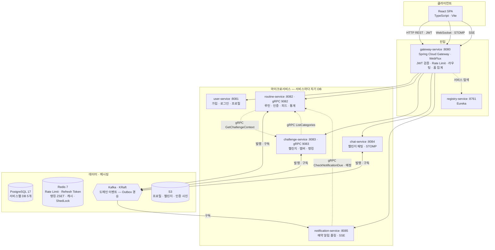

# Routinely Backend

소규모 그룹 챌린지를 통해 루틴을 인증하고 꾸준함을 만들어가는 **웹 기반 루틴 플랫폼**의 백엔드 저장소입니다.

**핵심 사용자 흐름**: 회원가입 → 루틴 생성 → 챌린지 참여 → 수행 인증 → 피드/채팅 공유 → 통계·랭킹 확인

---

## 기술 스택

| 분류 | 기술 |
|---|---|
| Language | Java 21 |
| Framework | Spring Boot 4.0.5 |
| Build | Gradle (Groovy DSL, 멀티모듈) |
| ORM | Spring Data JPA + QueryDSL |
| Security | Spring Security + JWT |
| Service Discovery | Eureka |
| Messaging | Apache Kafka (Outbox 패턴) |
| Job Queue | 예약 테이블 폴링 (ADR-0045) |
| DB | PostgreSQL × 5 (서비스별 독립) |
| Cache | Redis |
| gRPC | grpc-spring-boot-starter |
| Resilience | Resilience4j |
| Observability | Micrometer Tracing + Zipkin · Loki · Prometheus · Grafana |
| Infra | Docker Compose |

---

## 시스템 아키텍처



- **점선은 gRPC(동기), 실선은 HTTP·Kafka(비동기)** 다. 토픽별 발행·구독과 연결 상태는 [`service-interaction-map.md`](docs/architecture/service-interaction-map.md)가 담당한다
- **통신 원칙** — Command → gRPC · Event → Kafka(Outbox) · Job → DB 폴링 · Client 요청 → HTTP
- **데이터** — PostgreSQL은 서비스마다 독립 DB, 파일은 S3(로컬은 LocalStack), 관측은 Zipkin · Prometheus · Loki(Alloy) · Grafana

> 이 그림은 **이 README 한 곳에만** 둔다. 서비스 · 포트 · 통신 방식이 바뀌면 여기를 고친다.
> 2026-04에 그린 SVG · HTML 그림은 포트 · gRPC 관계 · 큐 구현이 낡아 **2026-09-13에 걷어냈다**(필요하면 git 이력에서 볼 수 있다).

### 서비스 목록

| 서비스 | 역할 | HTTP | gRPC |
|---|---|:---:|:---:|
| `registry-service` | Eureka 서버 | 8761 | — |
| `gateway-service` | 라우팅, JWT 검증, Rate Limiting | 8080 | — |
| `user-service` | 회원가입 / 로그인 / 프로필 | 8081 | 9081 |
| `routine-service` | 루틴 생성 / 수행 기록 / 피드 / 통계 | 8082 | 9082 |
| `challenge-service` | 챌린지 생성 / 참여 / 랭킹 | 8083 | 9083 |
| `chat-service` | WebSocket/STOMP 채팅 | 8084 | 9084 |
| `notification-service` | 알림 스케줄러/워커 | 8085 | 9085 |

### 서비스 간 통신

| 통신 방식 | 기술 | 사용 시점 |
|---|---|---|
| 클라이언트 ↔ 서버 | HTTP REST | 일반 API 요청 |
| 실시간 채팅 | WebSocket / STOMP | 채팅 메시지 송수신 |
| 실시간 알림 | SSE | 서버 → 클라이언트 단방향 |
| 서비스 간 동기 | gRPC | 즉시 응답이 필요한 Command |
| 서비스 간 비동기 | Kafka + Outbox 패턴 | 도메인 이벤트 |
| 서비스 내부 비동기 | 예약 테이블 폴링 | 알림 예약 Job |

---

## 멀티모듈 구조

```
routinely-backend/
├── libs/
│   ├── common-core/          # 공통 유틸, 에러, ApiResponse (순수 도메인)
│   ├── common-jpa/           # JPA 공통 설정 (BaseEntity, JpaAuditingConfig)
│   ├── common-web/           # Web 필터, MDC, 공통 ExceptionHandler
│   ├── common-observability/ # 로깅/트레이싱 Bean 설정
│   └── proto/                # gRPC Proto 정의 + 생성 스텁
├── services/
│   ├── registry-service/
│   ├── gateway-service/
│   ├── user-service/
│   ├── routine-service/
│   ├── challenge-service/
│   ├── chat-service/
│   └── notification-service/
├── infra/
│   ├── docker-compose.yml
│   └── docker-compose.observability.yml
└── scripts/
    ├── local-up.sh
    └── local-down.sh
```

### libs 의존성

| 서비스 | 의존하는 libs |
|---|---|
| registry-service | — |
| gateway-service | common-core, common-observability |
| user-service | common-web, common-jpa, common-observability |
| routine-service, challenge-service, chat-service | common-web, common-jpa, common-observability, proto |
| notification-service | common-web, common-jpa, common-observability |

> `common-web`은 `common-core`를 전이 포함합니다.

---

## 빠른 시작

### 사전 요구사항

- JDK 21
- Docker Desktop
- Gradle (또는 `./gradlew` Wrapper 사용)

### 1. 인프라용 환경 변수 설정

```bash
cp infra/.env.example infra/.env
# infra/.env 파일을 열어 필요한 값을 채워주세요.
```

`infra/.env`는 `docker compose`, `./scripts/local-up.sh`, `./scripts/local-down.sh`에서 사용하는 **인프라용 환경 변수 파일**입니다.

| 변수 | 필수 | 설명 |
|---|:---:|---|
| `DB_PASSWORD` | ✓ | PostgreSQL 컨테이너 비밀번호 |
| `JWT_SECRET` | ✓ | Gateway JWT 서명 검증용 시크릿 (`openssl rand -base64 32`) |
| `GATEWAY_SECRET` | ✓ | X-Gateway-Secret 헤더 값. 내부 서비스 직접 호출 여부 검증 (`openssl rand -hex 32`) |
| `GRAFANA_PASSWORD` | — | Grafana 관리자 비밀번호 (미설정 시 기본값 `admin`) |
| `EUREKA_HOST` | prod only | registry-service 호스트명. `prod` 프로파일 전용, 로컬에서는 불필요 |
| `RATE_LIMIT_CAPACITY` | — | 윈도우 내 최대 허용 요청 수 (기본: 30) |
| `RATE_LIMIT_REFILL_PERIOD_SECONDS` | — | 윈도우 크기 초 단위 (기본: 60) |
| `RATE_LIMIT_TRUSTED_PROXIES` | prod only | 신뢰할 프록시 IP. `prod` 프로파일 전용, 미설정 시 기동 실패 |
| `RATE_LIMIT_FAIL_OPEN_ON_REDIS_ERROR` | — | Redis 장애 시 요청 통과 여부 (기본: false) |
| `NICKNAME_COOLDOWN_DAYS` | — | 닉네임 재변경 허용 대기 일수 (기본: 30) — user-service |

> `bootRun` 또는 IDE로 개별 서비스를 직접 실행할 때 `infra/.env`가 자동으로 로드되지는 않습니다.

### 2. 인프라 기동

```bash
# PostgreSQL, Redis, Kafka만 기동
./scripts/local-up.sh

# Observability 스택 포함 기동 (Zipkin, Prometheus, Grafana, Loki)
./scripts/local-up.sh --obs
```

### 3. 서비스 실행

#### 스프링 프로파일 정책

| 프로파일 | 역할 |
|---|---|
| `local` | 로컬 개발 환경 설정 (GatewayAuthFilter 비활성화 등) |
| `prod` | 배포 환경 설정 |
| `observability` | Observability 스택(Zipkin·Prometheus·Grafana·Loki) 활성화 — 단독 사용 불가, 반드시 다른 프로파일과 조합 |

`observability`는 독립적인 애드온 프로파일이다. `local` 또는 `prod`와 조합해서 사용한다.

| 조합 | 사용 시점 |
|---|---|
| `local` | 평소 로컬 개발 (기본값) |
| `local,observability` | 로컬에서 Observability 스택까지 함께 확인할 때 |
| `prod` | 배포 |
| `prod,observability` | 배포 환경에서 Observability 스택 활성화 |

```bash
# 전체 빌드
./gradlew build

# 평소 개발 (local 프로파일)
./gradlew :services:user-service:bootRun --args='--spring.profiles.active=local'

# 로컬에서 Observability 스택까지 확인할 때 (local-up.sh --obs 와 함께 사용)
./gradlew :services:user-service:bootRun --args='--spring.profiles.active=local,observability'
```

`user-service`, `routine-service`, `challenge-service`, `chat-service`, `notification-service`는 `common-web`의 `GatewayAuthFilter`를 사용합니다.

- `local` 프로파일에서는 Gateway 없이 직접 호출할 수 있도록 필터가 비활성화됩니다.
- `local` 프로파일이 아니면 `gateway.secret` 설정이 필요합니다.

### 4. 인프라 종료

```bash
# 컨테이너 종료 (볼륨 유지)
./scripts/local-down.sh

# 컨테이너 + 볼륨 삭제 (데이터 초기화)
./scripts/local-down.sh -v
```

### 접속 URL

| 서비스 | URL |
|---|---|
| API Gateway | http://localhost:8080 |
| Eureka Dashboard | http://localhost:8761 |
| Zipkin | http://localhost:9411 (`local,observability` 프로파일 + `--obs` 실행 시) |
| Prometheus | http://localhost:9090 (`local,observability` 프로파일 + `--obs` 실행 시) |
| Grafana | http://localhost:3000 (`local,observability` 프로파일 + `--obs` 실행 시) |

---

## 개발 가이드

| 문서 | 경로 |
|---|---|
| 코딩 컨벤션 (Controller) | `docs/conventions/controller.md` |
| 코딩 컨벤션 (Service / DTO) | `docs/conventions/service-dto.md` |
| 코딩 컨벤션 (Entity / Repository) | `docs/conventions/entity-repository.md` |
| 코딩 컨벤션 (예외 처리) | `docs/conventions/exception-handling.md` |
| 코딩 컨벤션 (Outbox 패턴) | `docs/conventions/outbox-pattern.md` |
| 코딩 컨벤션 (테스트) | `docs/conventions/testing.md` |
| REST API 명세 | `docs/requirements/api-spec.md` |
| Kafka 이벤트 명세 | `docs/requirements/event-spec.md` |
| gRPC 서비스 명세 | `docs/requirements/grpc-spec.md` |
| 아키텍처 결정 기록 (ADR) | `docs/decisions/` |

---

## 브랜치 전략

| 브랜치 | 용도 |
|---|---|
| `main` | 배포 기준 브랜치 |
| `feat/{이슈번호}-{설명}` | 신규 기능 개발 |
| `refactor/{이슈번호}-{설명}` | 리팩토링 |
| `fix/{이슈번호}-{설명}` | 버그 수정 |
| `chore/{이슈번호}-{설명}` | 빌드/설정/문서 |

모든 변경은 PR을 통해 `main`에 머지합니다. PR 작성 시 `.github/pull_request_template.md` 양식을 따릅니다.
