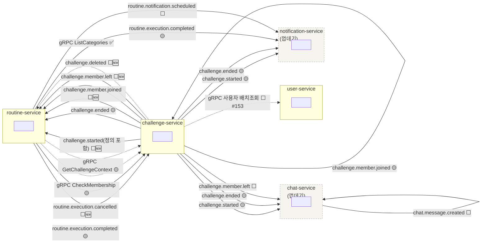
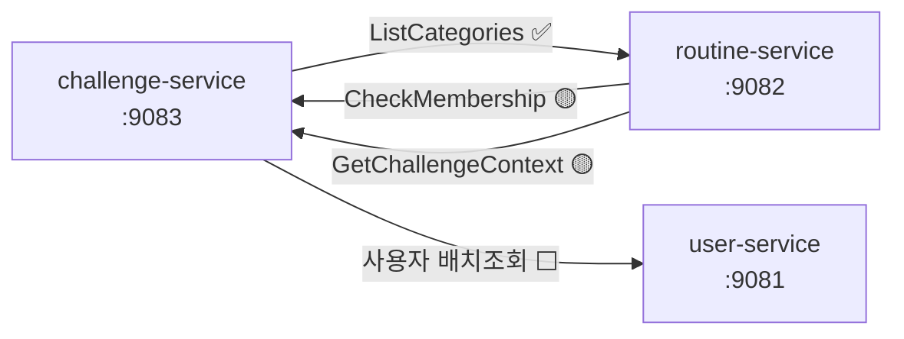
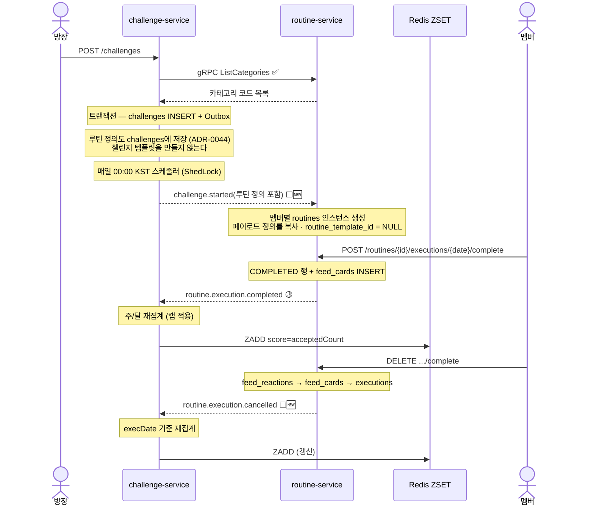
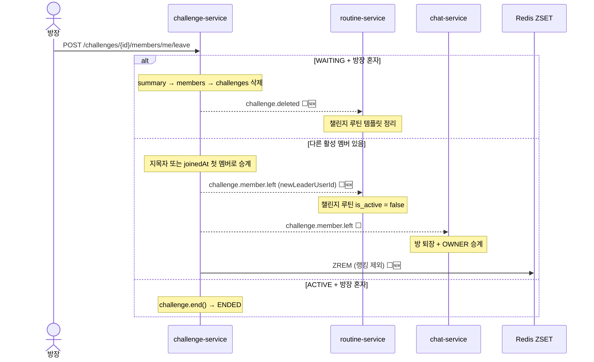

# 서비스 상호작용 지도 — Kafka 이벤트 · gRPC

> **이 문서는 그림이 본문이다.** REST API는 Swagger가 담당하지만 **이벤트와 gRPC는 코드를 다 열어보기
> 전에는 전경이 보이지 않는다.** 여기서 "누가 무엇을 발행하고 누가 받는가"를 한 장으로 본다.
>
> **최종 갱신**: 2026-08-23 · **기준**: backend `main` + `feat-57-routine-execution` 워크트리
>
> 상세 페이로드는 `docs/requirements/event-spec.md` · `grpc-spec.md`를 본다. 이 문서는 **관계와 상태**만 담는다.

## 범례

| 표기 | 뜻 |
|---|---|
| ✅ | 발행·소비 양단이 구현되어 동작한다 |
| 🟡 | 한쪽만 있다 (발행만 / 소비자만) |
| ⬜ | 양쪽 다 없다 |
| 🆕 | 규약 정리(2026-08-23)로 **신설이 결정된 것** |

---

## 1. 전체 지도

**점선은 gRPC(동기), 실선은 Kafka(비동기)다.** 회색 점선 박스는 아직 껍데기인 서비스다.

---

## 2. Kafka 토픽

### 발행·구독 매트릭스

| 토픽 | Publisher | Subscriber | 파티션 키 | 상태 |
|---|---|---|---|:---:|
| ~~`challenge.created`~~ | ~~Challenge~~ | ~~Routine~~ | — | ⛔ **폐지** (ADR-0044) |
| `challenge.started` | Challenge | Routine · Notification · Chat | `challengeId` | 🟡 발행만 · **정의 필드 추가 예정** 🆕 |
| `challenge.ended` | Challenge | Routine · Notification · Chat | `challengeId` | 🟡 발행만 |
| `challenge.member.joined` | Challenge | **Challenge**(랭킹) · Chat · Notification · **Routine** 🆕 | `challengeId` | 🟡 부분 |
| `challenge.member.left` | Challenge | Chat · **Routine** 🆕 · **Challenge**(랭킹 제외) 🆕 | `challengeId` | 🟡 부분 |
| **`challenge.deleted`** 🆕 | Challenge | Routine | `challengeId` | ⬜ |
| `routine.execution.completed` | Routine | Challenge · Notification | `userId` | 🟡 소비자만 |
| **`routine.execution.cancelled`** 🆕 | Routine | Challenge | `userId` | ⬜ |
| `routine.notification.scheduled` | Routine | Notification | `userId` | ⬜ |
| `chat.message.created` | Chat | Chat (전 인스턴스) | `roomId` | ⬜ |

> **모든 발행은 Outbox를 거친다**(ADR-0012). 소비는 Inbox에 적재 후 스케줄러가 처리한다(ADR-0014).

### 신설·변경이 결정된 것 (2026-08-23)

| | 무엇 | 왜 |
|---|---|---|
| 🆕 | **`routine.execution.cancelled`** | 완료 이벤트만 있어 **랭킹이 오르는 경로만 있고 내려가는 경로가 없었다.** 소비 측은 `execDate` 기준으로 해당 주/달을 **재집계**한다 — 캡(ADR-0027/0043) 때문에 단순 감소는 틀린다 |
| 🆕 | **`challenge.deleted`** | `WAITING`에서 방장이 혼자 탈퇴하면 챌린지를 하드 삭제하는데(ADR-0042), routine-service의 챌린지 템플릿이 고아로 남는다 |
| 🔧 | `challenge.member.left` **페이로드** | `newLeaderUserId` 추가 — 승계당한 사람이 자기가 방장이 된 걸 알 방법이 없었다 |
| 🔧 | `challenge.member.left` **구독자** | **Routine 추가**(챌린지 루틴 비활성화) · **Challenge 추가**(랭킹 제외 + ZSET `ZREM`) |
| 🔧 | `challenge.member.joined` **구독자** | **Routine 추가**(v2 — `ACTIVE` 재참여 시 루틴 인스턴스 복원) |

---

## 3. gRPC 호출 관계

| 호출 | 방향 | 용도 | 상태 |
|---|---|---|:---:|
| `ListCategories` | Challenge → Routine | 챌린지 생성 시 카테고리 코드 검증 (Redis 캐시 TTL 24h) | ✅ |
| `CheckMembership` | Routine → Challenge | 챌린지 루틴 완료 시 멤버십 검증 (#58) | 🟡 서버만 |
| `GetChallengeContext` | Routine → Challenge | 챌린지 기간·상태 조회 | 🟡 서버만 |
| 사용자 배치 조회 | Challenge → User | 랭킹·멤버 목록의 닉네임 채우기 (#153) | ⬜ |

> **트랜잭션 안에서 gRPC를 호출하지 않는다.** 검증은 트랜잭션 시작 전에 파사드에서 끝낸다
> (`tech-story.md` "트랜잭션 경계와 원격 호출 분리" 참고).

---

## 4. 시나리오 시퀀스

### 4-1. 챌린지 생성 → 시작 → 인증 → 랭킹

### 4-2. 방장 탈퇴 — 승계 / 삭제

---

## 5. 이 문서를 갱신하는 규칙

**토픽·RPC·구독자가 바뀌면 이 문서를 같은 커밋에서 고친다.** 순서는 아래와 같다.

1. `docs/requirements/event-spec.md` 또는 `grpc-spec.md` — **상세 페이로드**(계약)
2. **이 문서** — 관계도 · 매트릭스 · 상태 배지
3. `docs/product/policies.md` §9 — 그 변경이 규약 결정에서 나왔다면 해당 줄 해소 표시

### 무엇을 고치나

| 상황 | 고칠 곳 |
|---|---|
| 토픽 신설·폐기 | §1 그래프 · §2 매트릭스 |
| 구독자 추가·제거 | §1 그래프 · §2 매트릭스 |
| 페이로드 필드 변경 | `event-spec.md`(상세) + §2 "신설·변경" 표에 한 줄 |
| RPC 추가·시그니처 변경 | §3 그래프 · 표 + `grpc-spec.md` |
| 양단 배선 완료 | **상태 배지를 🟡·⬜ → ✅ 로** |
| 흐름이 바뀌는 결정 | §4 시퀀스 |

> **상태 배지 갱신을 빠뜨리지 않는다.** 이 문서의 값은 "무엇이 아직 안 이어졌는지"가 한눈에 보이는 데 있다.
> 전부 ✅가 되면 그때부터는 관계도로만 쓴다.

### Mermaid를 쓰는 이유

텍스트라서 **diff가 남고 리뷰가 된다.** 이미지 파일이면 누가 언제 무엇을 바꿨는지 알 수 없고, 결국
낡은 그림이 남는다. GitHub·IDE·이 저장소의 마크다운 뷰어에서 그대로 렌더된다.
