# 기술 스택 및 아키텍처 설계

---

## 시스템 아키텍처 다이어그램



---

## 1. 프론트엔드

**기본 스택**

- `React` & `TypeScript`
- `Vite` (빠른 개발 / 빌드)
- `React Router` (SPA 라우팅)
- `React Query` (서버 상태/캐싱/로딩/리트라이)
- `Zustand` (가벼운 전역 상태: 로그인 사용자/토스트/UI 상태)
- `STOMP` (WebSocket client) — 채팅 실시간
- `axios` (HTTP 클라이언트)

**UI / 디자인 시스템**

- `Tailwind CSS` + `shadcn/ui`
  - Tailwind로 레이아웃 / 간단 스타일
  - shadcn/ui로 버튼 / 모달 / 폼 / 테이블 등 빠르게 구성

**폼 / 검증**

- `React Hook Form`
- `Zod` (스키마 기반 검증)

---

## 2. 백엔드

**공통 (모든 서비스)**

- `Java 21` + `Spring Boot 4.0.5`
- `Spring Security` + `JWT`
- `OAuth2` 소셜 로그인 — **MVP 이후** (카카오, 구글)
- `Spring Data JPA`
- `QueryDSL` (조회 최적화 / 복잡한 조건 검색)
- `Swagger (OpenAPI)` (REST API 문서화)
- `Resilience4j` (timeout / retry / circuit breaker)
- OpenTelemetry(선택) + Prometheus / Grafana 연동 기반 마련

**MSA 서비스 구성**

| 서비스 | 역할 |
|---|---|
| API Gateway (`Spring Cloud Gateway`) | 라우팅, JWT 검증, Rate Limiting |
| registry-service (`Eureka Server`) | 서비스 등록 및 디스커버리 (ADR-0025) |
| User Service | 회원가입 / 로그인 / 프로필 |
| Challenge Service | 챌린지 생성 / 참여 / 랭킹 |
| Routine Service | 루틴 생성 / 수행 / 피드 / 통계 |
| Chat Service | WebSocket / STOMP + 메시지 저장 |
| Notification Service | 예약 기반 알림 스케줄러 / 워커 |
| (확장 예정) Report Service | 집계 / 랭킹 분리 — 트래픽 증가 시 도입 |

> MVP에서는 Report Service를 구현하지 않는다.
> 통계/집계는 Routine Service에서 직접 SQL 조회로 처리한다.

**서비스 간 통신**

| 목적 | 기술 |
|---|---|
| 클라이언트 ↔ 서버 | HTTP (REST) |
| 서비스 ↔ 서비스 동기 요청 | gRPC |
| 서비스 ↔ 서비스 비동기 이벤트 | Kafka |
| 서비스 내부 비동기 작업 | PGMQ |

---

## 3. 데이터베이스 / 스토리지 / 캐시

**RDB (주 데이터)**

- `PostgreSQL`
  - 사용 서비스: User, Challenge, Routine, Chat, Notification
  - 목적: 모든 서비스의 주 데이터 저장 (채팅 메시지 포함)

**캐시 / 세션 / Rate Limit**

- `Redis`
  - Rate Limiting (Token Bucket) — Gateway 레벨
  - 랭킹 캐시 (ZSET 기반)
    - 키: `ranking:group:{groupId}`, 값: memberId, score: 완료 수
    - `ZINCRBY`로 루틴 완료 시 업데이트, `ZREVRANGE`로 Top N 조회
  - 그룹 대시보드 캐시 (TTL 30s~2m)
  - 채팅 presence / 온라인 상태 (확장)
  - JWT 블랙리스트 — **MVP 이후** (`bl:token:{jti}` TTL=토큰 만료시간)

**Redis 활용 우선순위 (MVP 기준)**

1. Rate Limiting (Gateway 레벨)
2. 랭킹 (ZSET) 또는 랭킹 캐시
3. 그룹 대시보드 캐시
4. 채팅 presence (확장)
5. JWT 블랙리스트 (MVP 이후)

> MVP에서는 DB로 직접 랭킹 조회도 가능하다.
> Redis 랭킹은 성능 개선 및 포트폴리오 포인트로 활용한다.

**파일 저장**

- Object Storage (초기 구현: `AWS S3`)
  - 인증 사진 업로드
  - 채팅 이미지 업로드
  - `FileStorage` 인터페이스로 추상화 → 벤더 교체 가능하게 설계 (Azure Blob 등)
  - DB에는 URL 전체가 아닌 `key` / `contentType` / `size` 등 최소 메타만 저장

---

## 4. 이벤트 / 메시징 전략

**역할 분리 원칙**

| 패턴 | 기술 |
|---|---|
| Command (즉시 응답 필요) | gRPC |
| Event (도메인 이벤트 전달) | Kafka |
| Job (내부 비동기 작업) | PGMQ |
| Client 요청 | HTTP (REST) |

**PGMQ vs Kafka 선택 기준**

| 기준 | PGMQ | Kafka |
|---|---|---|
| 최우선 가치 | 정합성 / 신뢰성 | 확장성 / 처리량 |
| 트랜잭션과 결합 | 매우 좋음 (Postgres 내) | 직접 결합 어려움 (Outbox 필요) |
| 운영 복잡도 | 낮음 (Postgres만 운영) | 높음 (클러스터 운영) |
| 다중 소비자 | 가능하나 구조 제한적 | 매우 강함 (컨슈머 그룹) |
| 대량 이벤트 | 중간 규모까지 OK | 최적 |
| 재처리 / 리플레이 | 제한적 | 강력 |

**Routinely 적용**

- **PGMQ**: 정합성 이벤트
  - 알림 예약 등록, 내부 후처리 작업
- **Kafka**: 스트림 이벤트
  - 루틴 완료 이벤트 (`routine.execution.done`) → Notification / Feed
  - 채팅 메시지 멀티 인스턴스 브로드캐스트 (`chat.message.created`)
  - 챌린지 멤버 참여 이벤트 (`challenge.member.joined`) → Chat 캐시 무효화

---

## 5. 배포 / 인프라

**로컬 개발**

- `Docker Compose`
  - PostgreSQL / Redis / Kafka
  - PGMQ는 PostgreSQL 확장으로 별도 컨테이너 불필요

**배포 로드맵**

**1단계 (MVP)**

- AWS EC2 + Docker
- Nginx (리버스 프록시 / 정적 리소스)
- S3 + CloudFront (프론트 정적 배포)
- 백엔드 컨테이너는 EC2에서 구동

**2단계 (확장)**

- Kubernetes (EKS 또는 k3s)
- Ingress Controller (Nginx Ingress)
- HPA (오토스케일)

---

## 6. CI/CD

- `GitHub Actions`
  - PR 시: build / test
  - main merge 시: docker build / push

---

## 7. 로깅 / 모니터링

| 역할 | 도구 |
|------|------|
| 분산 추적 | `Micrometer Tracing` + `Zipkin` |
| 로그 수집 | `Grafana Alloy` → `Loki` |
| 메트릭 수집 | `Prometheus` |
| 시각화 | `Grafana` (메트릭 + 로그 통합) |
| 알림 | `Prometheus AlertManager` → Slack |

- 모든 서비스는 JSON 구조 로그를 stdout 출력 (`logstash-logback-encoder`)
- `traceId` / `spanId`는 Micrometer Tracing이 자동 주입
- Spring Cloud Sleuth는 Spring Boot 4.x에서 지원 종료 → Micrometer Tracing으로 대체

> 상세 설정은 [observability.md](./observability.md) 참조

---

## 8. 알림 서비스 설계

### 목표

- 전 유저 스캔 없이 (Pull 방식 ❌)
- **예약(Push) 기반**으로 안정적 발송
  - 루틴 시작 알림 / 마감 리마인드 알림
  - 챌린지 이벤트 알림

### 핵심 설계 원칙

- **PENDING은 "다음 1건만" 유지한다**
- **발송 성공 시 다음 1건을 즉시 예약한다** (Next-One Chaining)
- **내부 비동기 실행은 PGMQ로 처리한다**
- **이력은 DeliveryLog로 남긴다**

### 저장 구조

| 테이블 / 큐 | 역할 |
|---|---|
| `NOTIFICATION_SCHEDULES` | 앞으로 보내야 할 알림 1건 저장 (PENDING \| SENT \| FAILED \| CANCELED) |
| `NOTIFICATION_DELIVERY_LOGS` | 실제 발송 결과 / 응답 이력 |
| `PGMQ Queue` | due 기반으로 실행할 job 보관 (payload: scheduleId) |

- `recurring_key` = `userId + templateId + type (+timeBucket)` → 같은 루틴/타입의 "다음 1건"을 유일하게 관리

### 동작 흐름

**A. 루틴 생성/수정 시 (첫 예약 생성)**

1. RoutineService에서 루틴 생성 / 수정
2. 다음 알림 시각 계산 (예: 매일 07:00 루틴 → 다음 sendAt = 가장 가까운 06:55)
3. NotificationService에 요청 (gRPC)
4. `NOTIFICATION_SCHEDULES` upsert (PENDING, sendAt)
5. PGMQ에 `due=sendAt`으로 enqueue

> 이 단계에서 미래 n일치를 만들지 않고, **다음 1건만** 만든다.

**B. 알림 발송 시 (체인으로 다음 1건 생성)**

```
PGMQ Worker
 └─ read(vt=N초) — 메시지를 N초간 invisible 처리
     └─ status == PENDING 확인 (멱등성 보장)
         └─ 알림 발송
             ├─ 성공 시:
             │    ├─ pgmq.delete(msg_id)
             │    ├─ schedule → SENT
             │    └─ PGMQ에 enqueue(vt=nextSendAt)  ← 다음 1건 체인
             └─ 실패 시:
                  ├─ 메시지 삭제 안 함
                  ├─ schedule은 PENDING 유지
                  ├─ vt 만료 후 메시지 자동 재등장 → 재시도
                  └─ read_ct > max_retry 초과 시:
                       ├─ schedule → FAILED
                       └─ pgmq.archive(msg_id) → DLT
```

### 운영 특징

- 스케줄러 전수 스캔 방식이 아님
- PGMQ 워커는 due된 job만 꺼내서 처리
- 폴링 간격: 1~5초 (정확도 / 구현 난이도 밸런스)
- DAILY_DIGEST도 동일한 체인 방식으로 1건만 PENDING 유지

---

## 9. 문서화 도구

| 대상 | 도구 | 비고 |
|---|---|---|
| gRPC API | `protoc-gen-doc` | `.proto` 파일에서 HTML / Markdown 자동 생성 |
| REST API | `Swagger (OpenAPI)` | Springdoc openapi-starter 기반, `/swagger-ui.html` 제공 |
| Kafka 이벤트 | `AsyncAPI` | 토픽 / 페이로드 / 컨슈머 그룹 스펙 명세 (`docs/requirements/event-spec.md` 참조) |
| 환경 변수 | `.env.example` | 실제 시크릿 없이 필요한 환경변수 목록과 설명 제공, 프로젝트 루트에 커밋 |
| 로컬 개발 가이드 | `README.md` | 서비스별 실행 방법, 환경변수 설정, Docker Compose 사용법 |

**운영 원칙**

- `.env` 파일은 `.gitignore`에 추가하고, `.env.example`만 커밋한다.
- Swagger UI는 `local` / `dev` 프로파일에서만 활성화한다 (`springdoc.api-docs.enabled: false` in prod).
- gRPC 문서는 빌드 파이프라인에서 자동 생성하여 `docs/grpc/` 디렉토리에 출력한다.
- Kafka 이벤트 명세는 `docs/requirements/event-spec.md`를 단일 소스로 유지한다.
