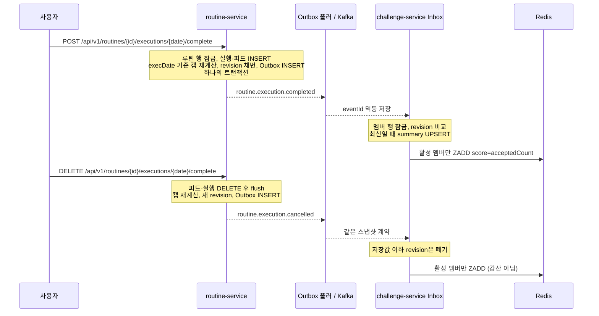

# ADR-0028: 이벤트 기반 집계 (CQRS) — ADR-0011 번복

- **Status**: Accepted
- **Date**: 2026-05-21
- **Author**: Routinely Project
- **Supersedes**: ADR-0011 (통계 집계 전략 — On-Demand 직접 SQL 집계)

---

## 1. Context

ADR-0011에서는 MVP 단계에서 `routine_executions`를 매 요청마다 직접 집계하는 방식을 채택했다.
이후 두 가지 요인이 추가되면서 재검토가 필요해졌다.

1. **달성률 캡 계산 복잡도 증가** (ADR-0027): `WEEKLY_N`/`MONTHLY_N`에서 주별/월별 캡을 적용하려면
   집계 쿼리가 단순 GROUP BY를 넘어 CTE + LEAST() 조합이 필요하다.
   이를 랭킹 조회마다 실행하면 멤버 수 × 쿼리 비용이 즉각적으로 발생한다.

2. **랭킹 Redis ZSET 동기화 필요**: `challenge_member_summary.achievement_rate`를
   Redis Sorted Set에 반영하려면 어차피 "완료 이벤트 발생 시점"에 갱신 트리거가 필요하다.
   On-Demand 구조에서는 Redis 동기화 시점을 자연스럽게 결정하기 어렵다.

---

## 2. Decision

**루틴 완료·취소와 Outbox를 같은 트랜잭션으로 저장하고, Consumer가 누적 인정 횟수와 revision을 반영한다.**

2026-09-23 #61 개정: 개인 통계는 ADR-0043에 따라 조회 시 계산하고, 이벤트 집계는 챌린지 랭킹에 사용한다.

ADR-0011의 "요청마다 직접 SQL 집계" 방식을 폐기한다.

### 흐름

### 조회

- **개인 통계**: 실행 기록으로 조회 시 계산(ADR-0043)
- **챌린지 랭킹**: Redis ZSET에서 O(log N) 조회 (fallback: `challenge_member_summary`)

---

## 3. Rationale

### 3.1 집계 비용을 쓰기 시점으로 이동

랭킹 조회는 조회 빈도가 쓰기 빈도보다 월등히 높다.
캡 계산 쿼리를 조회마다 수행하면 멤버 전원의 주별 집계를 반복적으로 계산해야 한다.
쓰기(완료 처리) 시점에 한 번 계산하고 저장해두면 조회는 O(1)이 된다.

### 3.2 Redis 동기화의 자연스러운 트리거

루틴 완료 이벤트가 발생하는 시점이 곧 "랭킹 갱신이 필요한 시점"이다.
이벤트 기반으로 연결하면 별도 스케줄러 없이 실시간에 가까운 랭킹 갱신이 가능하다.

### 3.3 ADR-0011 채택 당시와 조건 변화

ADR-0011 채택 이유 중 "집계 쿼리가 단순하다"는 전제가 ADR-0027(캡 계산) 도입으로 깨졌다.
단순 GROUP BY → CTE + LEAST() 조합으로 복잡도가 증가했으므로 결정을 번복한다.

---

## 4. Consumer 그룹 목록

완료·취소 모두 challenge-service만 소비한다. routine-service 개인 통계는 조회 시 계산하고,
notification-service는 발송 직전 gRPC로 판정한다(ADR-0043/0045).

| Consumer Group | 서비스 | 처리 내용 |
|---|---|---|
| challenge-service.ranking.routine.execution.completed | challenge-service | revision 비교 → summary UPSERT → 활성 멤버 ZADD |
| challenge-service.ranking.routine.execution.cancelled | challenge-service | 완료와 같은 처리 |

### 4.1 `challenge.member.joined` 자기 소비 — 랭킹 시드 (#48)

challenge-service는 **자신이 발행한** `challenge.member.joined` 이벤트를 **자신이 다시 소비**한다.
멤버가 참여하면 아직 완료 기록이 없어도 인정 횟수 0회인 랭킹 행이 즉시 노출되어야 하기 때문에,
소비 시점에 `challenge_member_summary`를 생성하고 Redis ZSET에 `0`점으로 시드(seed)한다.

| Consumer Group | 서비스 | 처리 내용 |
|---|---|---|
| `challenge-service.ranking.member.joined` | challenge-service (자기 소비) | `challenge_member_summary` 생성 + Redis ZSET `0`점 시드 |

**왜 참여 트랜잭션에서 바로 처리하지 않고 이벤트로 우회하는가:**

1. **집계 경로 단일화** — 랭킹 갱신을 담당하는 `ChallengeRankingInboxProcessor` 입장에서는
   이벤트가 자기 것(`member.joined`)이든 남의 것(`routine.execution.completed`)이든 동일하게 취급한다.
   참여만 동기 직접 호출로 처리하면 "랭킹을 갱신하는 방법"이 동기·비동기 두 갈래로 이원화되어
   유지보수 지점이 늘어난다. 자기 이벤트도 같은 Inbox 파이프라인에 태워 **단일 경로**로 유지한다.

2. **실패 격리** — 참여(멤버십 변경)는 DB 트랜잭션만으로 빠르게 확정하고, 랭킹 반영(Redis/summary)은
   별도 스케줄러가 독립적으로 재시도(최대 5회, 초과 시 `FAILED`)한다.
   join 트랜잭션 안에서 Redis를 직접 건드리면 Redis 지연·장애가 "챌린지 참여"라는 핵심 액션 자체를
   지연·실패시킬 수 있으나, 이벤트로 분리하면 참여 확정에는 영향이 없다.

3. **처리 멱등성** — 시드는 "이미 summary가 있으면 건너뛴다"로 처리한다.
   참여 후 완료 기록이 쌓여 인정 횟수가 오른 멤버가 이벤트 재처리로 0회로 리셋되면 안 되므로,
   재시드 시 기존 값을 덮어쓰지 않고 스킵하는 것이 핵심이다.

---

## 5. Consequences

### 긍정적 영향

- 랭킹/통계 조회 성능 O(N·집계쿼리) → O(1) 개선
- Redis ZSET 동기화 시점이 명확해짐
- 캡 계산을 쓰기 시점에 한 번만 수행

### 부정적 영향

- 완료 처리 → 이벤트 발행 → Consumer 처리까지 짧은 지연 존재 (통상 수백 ms 이내)
- Consumer 장애 시 summary가 일시적으로 오래된 값을 가질 수 있음
- 멱등성 처리 필요 (Inbox 테이블로 보장 — ADR-0013)

### 수용 가능 여부

랭킹/통계는 수백 ms 수준의 최종 일관성(eventual consistency)이 허용 가능한 데이터이므로
위 단점은 수용 가능하다.

---

## 6. 관련 결정

- ADR-0011: 번복된 원결정 (직접 SQL 집계)
- ADR-0012: Outbox 패턴 (이벤트 발행 정합성 보장)
- ADR-0013: 멱등성 전략 (Consumer 중복 처리 방지)
- ADR-0027: 달성률 캡 계산 (이 집계 방식의 계산 공식)

## 7. #61 구현 경계와 배포

- 순위는 accepted_count이며 100 상한이 없다. 동점은 공동 등수, 표시 순서는 last_completed_at
  빠른 순, 이후 userId다. DB fallback은 활성 멤버만 센다.
- last_completed_at은 "현재 인정 횟수에 **도달한** 시각"이다. **accepted_count가 늘어난 스냅샷의
  occurredAt으로만 옮긴다.** 캡 초과 완료나 취소처럼 횟수가 그대로거나 줄면 revision만 올리고 시각은
  둔다. 이벤트마다 덮어쓰면 캡을 넘겨 더 수행한 사람이 동점 나열에서 뒤로 밀린다. 취소로 줄어든 경우
  실제 도달 시각보다 늦은 값이 남을 수 있지만, 불리해지는 쪽은 취소한 본인뿐이라 허용한다.
- routine_event_revision_seq는 payload 직렬화 전에 채번한다. 루틴 행 잠금으로 같은 인스턴스의
  쓰기를 직렬화한다. #157은 챌린지·사용자마다 하나의 루틴 인스턴스를 유지해야 한다.
- Outbox는 SKIP LOCKED로 여러 폴러가 나눠 처리하며 ACK 이후 DB 상태를 커밋한다.
  ACK 타임아웃/DB 커밋 실패 시 중복 전송될 수 있으므로 Inbox eventId와 revision으로 보호한다.
- 폴러는 **첫 전송 실패에서 배치를 멈춘다.** 건너뛰고 계속 보내면 같은 userId 이벤트의 순서가
  뒤집히고, 브로커 장애 때 행마다 대기가 쌓여 잠금이 길어진다. 다만 인스턴스가 여럿이면 SKIP LOCKED로
  서로 다른 행을 동시에 보내므로 **Kafka 도착 순서는 보장하지 않는다** — 순서 판정은 소비자의
  revision 비교가 맡는다.
- 기존 achievement_rate/completed_count/total_scheduled는 보존하되 쓰기를 중단한다.
  기존 집계가 있는 배포에서는 옛 퍼센트 Redis 키를 비우고 routine-service에서 새 계약의
  스냅샷을 재발행해 재집계해야 한다. 과거 completed_count를 복사하면 기간별 캡을 복원할 수 없다.
  이번 마이그레이션은 과거 집계의 자동 백필을 수행하지 않는다.
- routine.notification.scheduled는 개인 시작·수정·중단에 연결됐다. #157 챌린지 시작과
  #158 탈퇴 비활성 경로는 각각 구현될 때 같은 발행 창구를 호출한다.
